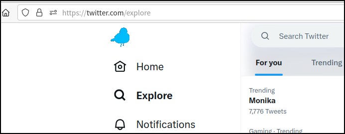
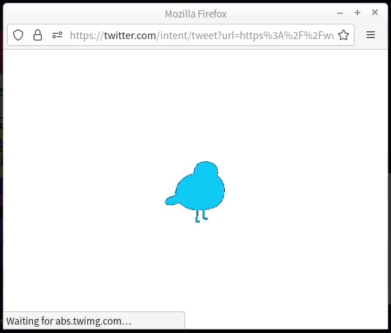
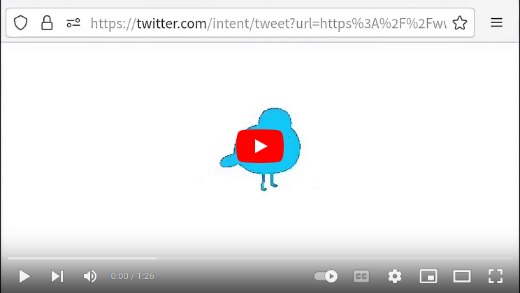

# Pigeon to Twitter

"I don’t want X, I want pigeons always."

**Pigeon to Twitter** is a userscript that can replace the ElonMusk's ugly X logo with a bouncing pigeon.

Credit to [Kéké](https://twitter.com/Kekeflipnote) for the bouncing pigeon animation.

## Showcase

### Screenshot

### Video

Video on YouTube: [Link](https://www.youtube.com/watch?v=on7PqWpgO8E)

## Installation

A **userscript manager** is needed. Here is my recommend:

-   Tampermonkey: [Firefox Add-ons](https://addons.mozilla.org/en-US/firefox/addon/tampermonkey/), [Chrome Web Store](https://chrome.google.com/webstore/detail/dhdgffkkebhmkfjojejmpbldmpobfkfo), [GitHub](https://github.com/Tampermonkey/tampermonkey), [Tampermonkey Homepage](https://www.tampermonkey.net/). You can also try some other userscript managers as you wish. You can find a lot information about userscript on [Greasy Fork's Homepage](https://greasyfork.org/).

After the userscript manager installed, go to the [Pigeon to Twitter on greasyfork.org](https://greasyfork.org/scripts/471889-pigeon-to-twitter) page and click the press the big install button, folloew the step, and it will be installed easily.

Open/Reload the Twitter, and enjoy the bouncing pigeon.

## Disabling and Uninstallation (For people who have no experience on userscript)

For Enabling/Disabling/Uninstallation, just click the switch in Tampermonkey.

## Feedback

Please post issues on [GitHub Issue](https://github.com/catscarlet/pigeon-to-twitter/issues).

Pull request is also welcome.

## Security

### Usage statistics?

Nope. No infomation is collected or submitted.

## Known issues

-   The way of query the ElonMusk's ugly X logo is to querySelector the X's svg path, which may change randomly without a notice. If this happens, this scripte may invalidate.
-   The bouncing pigeon animation is converted from a twitter GIF/MP4 video so the quality is a little poor. I didn't ask Kéké for a clear version.

## Source Code

<https://github.com/catscarlet/pigeon-to-twitter>

## License

GNU AFFERO GENERAL PUBLIC LICENSE Version 3
